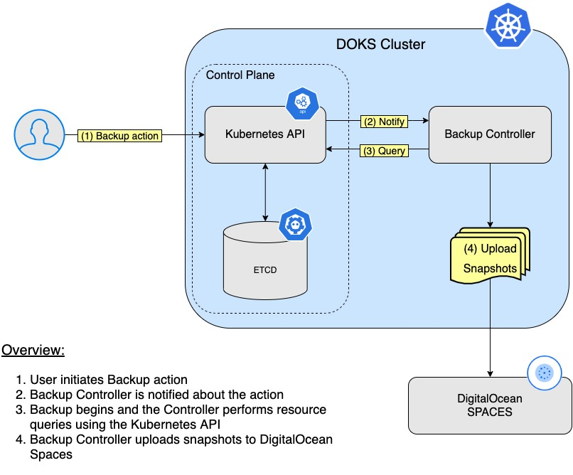

## Backup Using Velero <a name="VELE"></a>

For a detailed step-by-step tutorial, follow this community guide - [Installing the Velero Client](https://www.digitalocean.com/community/tutorials/how-to-back-up-and-restore-a-kubernetes-cluster-on-digitalocean-using-velero).

- [Overview](#overview)
- [How Velero Works](#how-velero-works)
- [Prerequisites](#prerequisites)
- [Velero Installation](#velero-installation)
- [Ambassador Edge Stack Backup and Restore Example](#ambassador-edge-stack-backup-and-restore-example)
- [Namespace Backup and Restore Example](#namespace-backup-and-restore-example)
- [Backup and Restore Whole Cluster Example](#backup-and-restore-whole-cluster-example)
- [Deleting Snapshots](#deleting-snapshots)
- [Final Notes](#final-notes)
- [Learn More](#learn-more)

### Overview

Why `Velero`?

`Velero` gives you tools to `back up` and `restore` your `Kubernetes cluster resources` and `persistent volumes`. You can run `Velero` with a `cloud provider` or `on-premises`. 

Advantages of using `Velero`:

* Take `backups` of your cluster and `restore` in case of loss.
* `Migrate` cluster resources to other clusters.
* `Replicate` your `production` cluster to `development` and `testing` clusters.

### How Velero Works

`Velero` consists of two parts:

* A `server` that runs on your cluster
* A `command-line client` that runs locally

Each `Velero` operation – `on-demand backup`, `scheduled backup`, `restore` – is a `custom resource`, defined with a `Kubernetes Custom Resource Definition` (CRD) and stored in `etcd`. Velero also includes `controllers` that process the custom resources to perform backups, restores, and all related operations.

You can `back up` or `restore all objects` in your cluster, or you can `filter objects` by `type`, `namespace`, and/or `label`.

Below is a diagram showing the backup workflow:



`Velero` is `ideal` for the `disaster recovery` use case, as well as for snapshotting your application state, prior to performing system operations on your cluster, like upgrades. For more details on this topic, please visit the [How Velero Works](https://velero.io/docs/v1.6/how-velero-works/) official page.

### Prerequisites

Before you get started you will need to do the following:

* Create a [Spaces](https://docs.digitalocean.com/products/spaces/how-to/create/) bucket and access keys. Save the `access` key and `secret` in a safe place for later usage. 
* You should have an DigitalOcean `API token`. If not, [create one](https://docs.digitalocean.com/reference/api/create-personal-access-token/) for `Velero` from the cloud console.

### Velero Installation

There are three parts involved:

1. A `client` (used to interact with the `Velero Server` and perform Backup/Restore operations)
2. A `server` (runs on the `DOKS Cluster` as a `Kubernetes` resource)
3. A `storage` provider for `Velero` to store your `resources` and `volumes`. In case of DigitalOcean this is `Spaces` (`S3` like objects storage) - already covered in the [Prerequisites](#prerequisites) section.

**Installing the Velero CLI**

Just follow the [CLI installation](https://velero.io/docs/v1.6/basic-install/#install-the-cli) steps for your OS distribution as detailed on the official page (in this tutorial `v1.6` is used).

**Installing the Velero Server and Storage Provider Plugins**

In the steps to follow you will deploy `Velero` and all the required components so that it will be able to perform backups for `Kubernetes` resources and `PV's`. The backup data will be stored in the DO `Spaces` bucket created earlier in the [Prerequisites](#prerequisites) section.

Steps to follow:

1. Add the `Helm` repository:

    ```
    helm repo add vmware-tanzu https://vmware-tanzu.github.io/helm-charts
    ```

2. A cloud credentials file needs to be provided in order for `Velero` to access `DO Spaces`. Create a `secrets.txt` file under the current working directory with the following content (make sure to replace the `<>` placeholders accordingly):

    ```
    [default]
    aws_access_key_id=<AWS_ACCESS_KEY_ID>
    aws_secret_access_key=<AWS_SECRET_ACCESS_KEY>
    ```

    The `<AWS_ACCESS_KEY_ID>` and `<AWS_SECRET_ACCESS_KEY>` represent your `DigitalOcean Spaces` key name and secret created in the [Prerequisites](#prerequisites) section.
3. Start the `deployment` for `Velero` and replace the required `<>` placehholders accordingly (each is explained down below):

    ```
    helm install velero vmware-tanzu/velero \
    --namespace velero \
    --create-namespace \
    --set credentials.extraEnvVars.digitalocean_token=<DIGITALOCEAN_API_TOKEN>  \
    --set-file credentials.secretContents.cloud=./secrets.txt \
    --set configuration.provider=aws \
    --set configuration.backupStorageLocation.bucket=<BUCKET_NAME> \
    --set configuration.backupStorageLocation.config.region=<REGION> \
    --set configuration.backupStorageLocation.config.s3Url=https://<REGION>.digitaloceanspaces.com \
    --set initContainers[0].name=velero-plugin-for-aws \
    --set initContainers[0].image=velero/velero-plugin-for-aws:v1.0.0 \
    --set initContainers[0].volumeMounts[0].mountPath=/target \
    --set initContainers[0].volumeMounts[0].name=plugins \
    --set initContainers[1].name=velero-plugin \
    --set initContainers[1].image=digitalocean/velero-plugin:v1.0.0 \
    --set initContainers[1].volumeMounts[0].mountPath=/target \
    --set initContainers[1].volumeMounts[0].name=plugins \
    --set snapshotsEnabled=true \
    --set configuration.volumeSnapshotLocation.provider=digitalocean.com/velero \
    --set deployRestic=false
    ```

    Explanations for the above configuration:

    * `configuration.provider` tells `Velero` to utilize the DigitalOcean `S3` like storage provider.
    * `configuration.volumeSnapshotLocation.provider` - DigitalOcean `Block Storage` provider plugin for `Velero`. The plugin is designed to create filesystem snapshots of `Block Storage` backed `PersistentVolumes` that are used in a `Kubernetes` cluster running on `DigitalOcean`.
    * `initContainers[<index>] ...` parts tell `Velero` to enable and use the required `plugins` for each `provider` being used.
    * `snapshotsEnabled` - enables snapshot feature.
    * `deployRestic` - whether to deploy the restic daemonset (disabled in this example because it's considered `beta`).
    * `<DIGITALOCEAN_API_TOKEN>` - your DigitalOcean `API Token`. `Velero` needs it in order to authenticate with the `DigitalOcean API` when manipulating snapshots.
    * `<BUCKET_NAME>` and `<REGION>` - your DigitalOcean Spaces `bucket name` and `region` (e.g.: `nyc3`) created in the [Prerequisites](#prerequisites) section.

**Verify the installation**

Check the `Velero` deployment:

```bash
helm ls -n velero
```

The output looks similar to the following:

```
NAME    NAMESPACE       REVISION        UPDATED                                 STATUS          CHART           APP VERSIONvelero  backup          1               2021-08-25 13:16:24.383446 +0300 EEST   deployed        velero-2.23.6   1.6.3 
```

Check that `Velero` is up and running:

```bash
kubectl get deployment velero -n velero
```

The output looks similar to the following:

```
NAME     READY   UP-TO-DATE   AVAILABLE   AGE
velero   1/1     1            1           67s
```

If you’re interested in looking further, you can view `Velero’s` server-side components by running (replace the `<>` placeholders accordingly):

```bash
kubectl -n velero get all
```

`Velero` also uses a number of `CRDs` (Custom Resource Definitions) to represents its own resources like backups, backups schedules, etc.

Some basic backup/restore examples will be provided in the next part.

### Ambassador Edge Stack Backup and Restore Example

Ensure that your `Ambassador Deployment` is running and there is a `Service` with an `EXTERNAL-IP` (`kubectl get service --namespace ambassador`). Browse the `IP` a few times to write some log entries to the persistent volume. Then create a `backup` with `Velero`:

```
velero backup create ambassador-backup --include-namespaces ambassador
velero backup describe ambassador-backup --details
```

You can inspect the new Kubernetes `Backup` object created as seen below:

```
~ kubectl get backup/ambassador-backup -n velero -o yaml

apiVersion: velero.io/v1
kind: Backup
metadata:
 annotations:
   velero.io/source-cluster-k8s-gitversion: v1.21.2
   velero.io/source-cluster-k8s-major-version: "1"
   velero.io/source-cluster-k8s-minor-version: "21"
 creationTimestamp: "2021-08-18T17:11:14Z"
 generation: 5
 labels:
   velero.io/storage-location: default
 name: ambassador-backup
 namespace: velero
 resourceVersion: "1870184"
 uid: 1163afa8-4521-4b6c-bc9c-2856666fd2e1
spec:
 defaultVolumesToRestic: false
 hooks: {}
 includedNamespaces:
 - ambassador
 storageLocation: default
 ttl: 720h0m0s
 volumeSnapshotLocations:
 - default
status:
 completionTimestamp: "2021-08-18T17:11:19Z"
 expiration: "2021-09-17T17:11:14Z"
 formatVersion: 1.1.0
 phase: Completed
 progress:
   itemsBackedUp: 86
   totalItems: 86
 startTimestamp: "2021-08-18T17:11:14Z"
 version: 1
```

When you look at the above result, please check that `includedNamespaces` value is set to `ambassador`.
    
Check that `backup-location` is ok as well - the `PHASE` column value should be `Available`. 
    
The output looks similar to the following:

```
~ velero backup-location get

NAME      PROVIDER        BUCKET/PREFIX               PHASE       LAST VALIDATED                  ACCESS MODE   DEFAULT
default   velero.io/aws   starterkit-velero-backups   Available   2021-08-18 17:22:44 +0000 UTC   ReadWrite     true

```

Looking inside the `DO Spaces bucket` there's a new folder named `backups`. The folder listing looks similar as in the picture down below:


As seen above, the backup files will be in your `Spaces` bucket. A snapshot of the persistent volume will be listed in the DigitalOcean control panel under the *Images* link. Now you can simulate a disaster by deleting the  `ambassador` namespace.

```bash
kubectl delete namespace ambassador
```

Once the delete finishes, restore the `ambassador-backup` backup:

```bash
velero restore create --from-backup ambassador-backup
```

Check that the restored `PersistentVolume`, `Deployment`, and `Service` are back using `kubectl`:

```bash
kubectl get persistentvolume --namespace ambassador
kubectl get service --namespace ambassador
kubectl get deployment --namespace ambassador
```

### Namespace Backup and Restore Example

In this scenario you will delete all namespaces except one. At the end you should be able to restore everything back.

Steps to follow:

1. Inspect cluster resources first (save the output to a file for later comparison):

    ```bash
    kubectl get all --all-namespaces
    ```
2. Create a backup for the whole `DOKS` cluster:
   
    ```bash
    velero backup create all-cluster
    ```

    **Note:**

    Check that the backup was created and that it's not reporting any errors before moving to the next step. The following command will list all the backups available.

    ```bash
    velero backup get
    ```

    For both curiosity and debugging, it’s useful to do a describe and logs on your backups:

    ```bash
    velero backup describe all-cluster
    velero backup logs all-cluster
    ```
3. Delete everything except the `velero` namespace:
   
    ```
    kubectl delete ns --namespace=velero --all
    ```
4. Restore everything by using the below command (takes around `30s` to complete):

    ```
    velero restore create --from-backup all-cluster
    ```

Inspect all the resources again and compare the output with the one saved at `Step 1`. You should have everything back in place.

### Backup and Restore Whole Cluster Example

In this scenario you will simulate a `disaster recovery` basically. The whole `DOKS` cluster will be deleted and then restored from a previous backup.

Steps to follow:

1. Inspect cluster resources first (save the output to a file for later comparison):

    ```bash
    kubectl get all --all-namespaces
    ```
2. Create a backup for the whole `DOKS` cluster:
   
    ```
    velero backup create all-cluster
    ```

    **Note:**

    Check that the backup was created and that it's not reporting any errors before moving to the next step. The following command will list all the backups available.

    ```bash
    velero backup get
    ```
    For both curiosity and debugging, it’s useful to do a describe and logs on your backups:

    ```bash
    velero backup describe all-cluster
    velero backup logs all-cluster
    ```
3. Delete the whole `DOKS` cluster (make sure to replace the `<>` placeholders accordingly):
   
    ```
    doctl kubernetes cluster delete <DOKS_CLUSTER_NAME>
    ```
4. Restore everything by using the below command:

    ```
    velero restore create --from-backup all-cluster
    ```

After the restore process finishes you should be able to see all resources re-created. Take a look at the `kubectl get all --all-namespaces` output and compare with the results before destroying the cluster.

### Deleting Snapshots

When you decide that some older snapshots are not needed anymore and want to free up some space on the `DO Spaces` bucket, then this command will help:

```
kubectl delete volumesnapshotlocation.velero.io -n velero starterkit-velero-backups
```

### Final Notes

You can back up your entire cluster, or optionally choose a namespace or label selector to back up.

They can be run one off or scheduled. It’s a good idea to have scheduled backups so you are certain you have a recent backup to easily fall back to. You can also create backup [hooks](https://velero.io/docs/v1.6/backup-hooks/) if you want to execute actions before or after a backup is made.

You can get more insight on the available `Velero` options via the `help pages` of the `CLI` executable:

```bash
velero -h
```

And for each command/subcommand:

```bash
velero <command> -h
```

Some other useful resources:

* [Backup command reference](https://velero.io/docs/v1.6/backup-reference)
* [Restore command reference](https://velero.io/docs/v1.6/restore-reference/)
* [Cluster migration](https://velero.io/docs/v1.6/migration-case/)

### Learn More

Hopefully you found this guide helpful. Here are some other resources to help you learn more.

[Velero](https://velero.io/)
[Velero Documentation](https://velero.io/docs/latest/)
[Velero GitHub](https://github.com/vmware-tanzu/velero)

Go to [Section 14 - Estimate resources for startup kit](../14-starter-kit-resource-usage)
